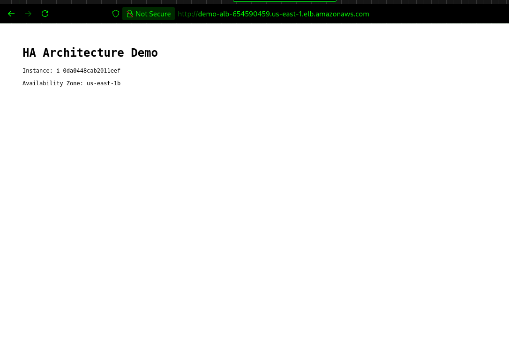
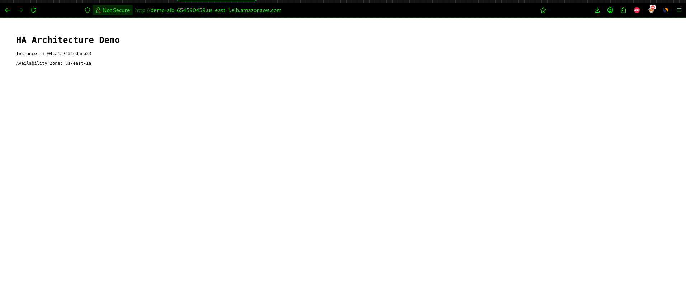
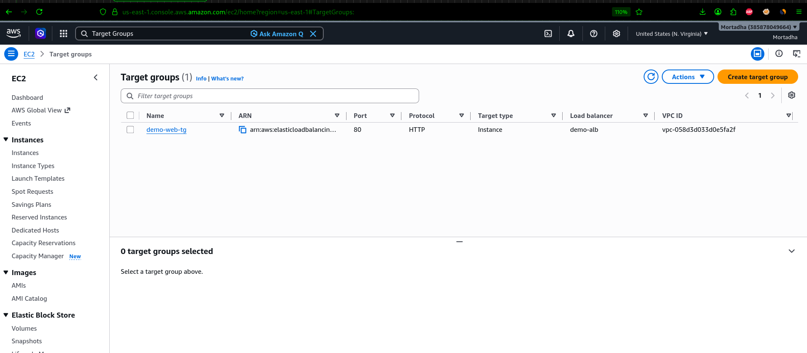
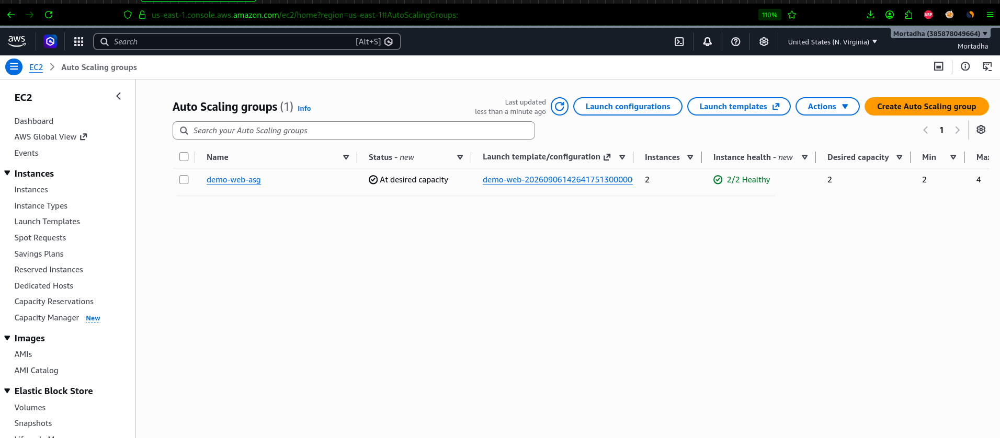

# Highly Available Web Architecture on AWS

A multi-AZ web architecture defined entirely in Terraform, built to be destroyed and rebuilt in minutes — and tested by actually breaking it.

The interesting part isn't the architecture diagram. It's what happens when an instance dies at 3am.

---

## What this builds

```
                        Internet
                            │
                            ▼
              ┌───────────────────────────┐
              │ Application Load Balancer │
              │  (public subnets, 2 AZs)  │
              │  health checks every 30s  │
              └────────────┬──────────────┘
                           │
         ┌─────────────────┴─────────────────┐
         ▼                                   ▼
┌──────────────────┐                ┌──────────────────┐
│  us-east-1a      │                │  us-east-1b      │
│  ┌────────────┐  │                │  ┌────────────┐  │
│  │  EC2 web   │  │                │  │  EC2 web   │  │
│  │  t3.micro  │  │                │  │  t3.micro  │  │
│  └─────┬──────┘  │                │  └──────┬─────┘  │
│        │         │                │         │        │
│  ┌─────▼──────┐  │                │  ┌──────▼─────┐  │
│  │ RDS MySQL  │◄─┼── synchronous ─┼─►│  standby   │  │
│  │  primary   │  │   replication  │  │            │  │
│  └────────────┘  │                │  └────────────┘  │
│  (private subnet)│                │ (private subnet) │
└──────────────────┘                └──────────────────┘
         └─────────────────┬─────────────────┘
                           │
              ┌────────────▼──────────────┐
              │    Auto Scaling Group     │
              │    min 2 · max 4          │
              │    target tracking @ 60%  │
              └───────────────────────────┘
```

**VPC** spanning two Availability Zones — public subnets for the load-balanced web tier, private subnets for the database.

**Application Load Balancer** distributing across both AZs, with health checks that pull an unhealthy target out of rotation.

**Auto Scaling Group** maintaining a minimum of two instances, using ELB health checks rather than EC2 status checks, with target tracking on average CPU.

**RDS MySQL Multi-AZ** with a synchronous standby in the second AZ and automatic failover.

**Security groups chained by reference**, not by CIDR — the web tier accepts traffic from the ALB security group only, and the database accepts traffic from the web tier security group only.

---

## What it looks like

Same URL, different Availability Zone — the load balancer distributing across both:





Target group with both instances healthy:



Auto Scaling Group holding desired capacity:



---

## Test 1 — killing a web instance

An architecture is only highly available if you've watched it survive something. So I terminated an instance while a client was hitting the load balancer once per second.

```bash
# Terminal 1 — continuous requests
while true; do
  curl -s --max-time 2 http://$ALB_DNS | grep -o "us-east-1[ab]" || echo "FAILED"
  sleep 1
done

# Terminal 2 — kill an instance
aws ec2 terminate-instances --instance-ids i-02debbb9ce5803b50
```

### What happened

```
us-east-1a
us-east-1b
us-east-1a
us-east-1b
us-east-1a
FAILED          ← one request caught mid-shutdown
us-east-1a
us-east-1b
us-east-1a
us-east-1b
...             ← service continues uninterrupted
```

**One failed request out of roughly forty.** The ALB pulled the dying target out of rotation within seconds, and traffic carried on across both AZs.

Meanwhile the Auto Scaling Group did its own work:

```
+----------------------+--------------+------------+--------------+
|  i-02debbb9ce5803b50 |  Terminating |  Unhealthy |  us-east-1a  |
|  i-0bff8715f8e5f17d0 |  InService   |  Healthy   |  us-east-1b  |
|  i-0d5bb3ecdbe0d17e8 |  Pending     |  Healthy   |  us-east-1a  |  ← replacement
+----------------------+--------------+------------+--------------+
```

| What | Observed |
|---|---|
| Failed requests during the event | 1 of ~40 |
| ALB removes unhealthy target | seconds |
| ASG launches replacement | ~2 minutes |
| AZs serving traffic throughout | 2 |

### Why those timescales differ

The ALB and the ASG both do health checking, and they react on very different timescales.

**The ALB** checks every 30 seconds and needs 3 consecutive failures to mark a target unhealthy — but removing it from rotation is immediate once decided. That's why traffic recovered in seconds.

**The ASG** waits out its `health_check_grace_period` (120s here) before acting, because it has to distinguish "this instance is dead" from "this instance is still booting". Killing a healthy instance mid-boot would be worse than waiting.

Setting `health_check_type = "ELB"` on the ASG is what connects the two. Without it, the ASG only watches EC2 status checks — and those stay green on an instance whose web server has crashed. The hardware is fine, the OS is fine, nothing is listening on port 80. You'd end up with an instance receiving no traffic from the ALB that the ASG considers perfectly healthy, indefinitely.

---

## Test 2 — forcing an RDS failover

Same principle, different layer. I forced a Multi-AZ failover and read the event log rather than guessing at the numbers.

```bash
aws rds reboot-db-instance --db-instance-identifier demo-mysql --force-failover

aws rds describe-events --source-identifier demo-mysql \
  --source-type db-instance --duration 20 \
  --query 'Events[].[Date,Message]' --output table
```

```
2026-09-08T18:09:24  Multi-AZ instance failover started.
2026-09-08T18:09:39  DB instance restarted
```

**15 seconds.** The DNS endpoint did not change — `demo-mysql.xxxxx.us-east-1.rds.amazonaws.com` still resolves, now pointing at what used to be the standby. No connection string to update, no config reload. The application never knows a failover happened.

That's the trade being made with Multi-AZ: you pay for compute you never actively use, and in exchange failover is 15 seconds instead of a restore from backup.

### A mistake worth sharing

I first tried to measure the outage by opening a TCP socket to port 3306 from my laptop:

```bash
timeout 3 bash -c "</dev/tcp/$DB_ENDPOINT/3306" && echo "OK" || echo "FAILED"
```

Every single attempt returned FAILED — before, during and after the failover. Not because the database was down, but because the database security group only accepts traffic from the web tier security group, and my laptop isn't in the VPC.

The failure to connect was the segmentation working exactly as designed. I was measuring the wrong thing.

The right measurement is the RDS event log, which records the failover with timestamps on both sides.

---

## Repository layout

```
.
├── main.tf              # provider, default tags, AZ data source
├── variables.tf         # region, environment, VPC CIDR, DB password
├── vpc.tf               # VPC, subnets, IGW, route tables
├── security-groups.tf   # ALB, web and database tiers, chained by reference
├── compute.tf           # ALB, target group, launch template, ASG, scaling policy
├── database.tf          # RDS MySQL Multi-AZ, subnet group, security group
├── outputs.tf           # VPC ID, subnet IDs, ALB DNS name, DB endpoint
├── docs/                # screenshots
└── README.md
```

---

## Running it

```bash
git clone https://github.com/Mortadha1996/aws-ha-architecture
cd aws-ha-architecture

aws configure          # credentials for a non-root IAM user
terraform init
terraform apply -var="db_password=YourSecurePassword"
```

The ALB DNS name comes out as an output. Hit it a few times and watch the AZ change.

```bash
terraform destroy -var="db_password=YourSecurePassword"
```

RDS Multi-AZ takes 10–15 minutes to provision — AWS builds the primary, the standby in the second AZ, then establishes replication.

---

## On cost

Two `t3.micro` instances, one ALB and a `db.t3.micro` in Multi-AZ come to roughly **$0.07/hour**. Destroy it when you're not using it and the whole exercise costs a couple of dollars.

**There is deliberately no NAT Gateway.** At ~$32/month it's the most expensive thing in a small architecture like this, and it exists to give private subnets outbound internet access. The database doesn't need it — RDS is managed, and the web tier sits in public subnets behind strict security groups. In production, with the web tier in private subnets, it becomes necessary. It's worth knowing what you're paying for.

---

## Design notes

**Security groups reference each other, not CIDR blocks.** The web tier allows port 80 from the ALB security group. The database allows port 3306 from the web security group. If any of them are rebuilt or change IPs, the rules still hold — and nothing is reachable from outside the chain.

**The database lives in private subnets from the start.** `publicly_accessible = false` and a subnet group made of private subnets. Putting a database in a public subnet is a mistake worth avoiding upfront rather than fixing after an audit.

**Storage is encrypted at rest** with the default KMS key, and `max_allocated_storage` enables autoscaling so a full disk doesn't take the database down.

**The launch template pulls instance metadata via IMDSv2.** The token-based flow — `PUT` to get a token, then `GET` with the token header — is the current standard. IMDSv1's unauthenticated GET was exploitable through SSRF in application code.

**Target tracking rather than step scaling.** Telling AWS "keep average CPU at 60%" is simpler and less brittle than defining thresholds and cooldowns by hand.

---

## Next

- S3 and CloudFront for static content
- CloudWatch alarms on target health, ALB 5xx rates and RDS connection count
- HTTPS with ACM and a redirect from port 80
- Read replica for read scaling

---

## Author

**Mortadha Riahi** — Infrastructure & Platform Engineer

AWS Solutions Architect – Associate · RHCE · RHCSA · Red Hat Ansible (×2) · CCNA

[LinkedIn](https://www.linkedin.com/in/mortadha-riahi/) · [AIOps anomaly detection](https://github.com/Mortadha1996/aiops-anomaly-detection) · [LLM inference platform](https://github.com/Mortadha1996/llm-inference-platform)
